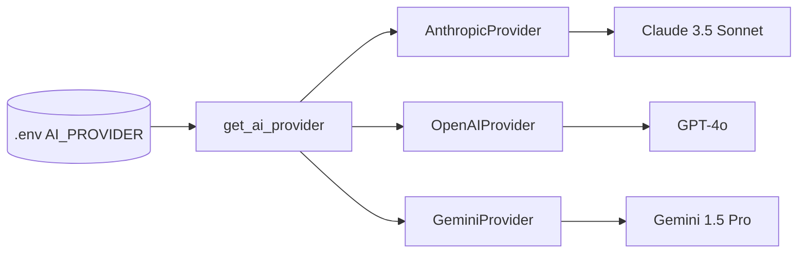

# AI Provider Factory Flow

```mermaid
graph LR
    Config[(.env AI_PROVIDER)] --> Factory[get_ai_provider]
    
    Factory --> Anthropic[AnthropicProvider]
    Factory --> OpenAI[OpenAIProvider]
    Factory --> Gemini[GeminiProvider]
    
    Anthropic --> Claude[Claude 3.5 Sonnet]
    OpenAI --> GPT4[GPT-4o]
    Gemini --> GeminiPro[Gemini 1.5 Pro]
```
