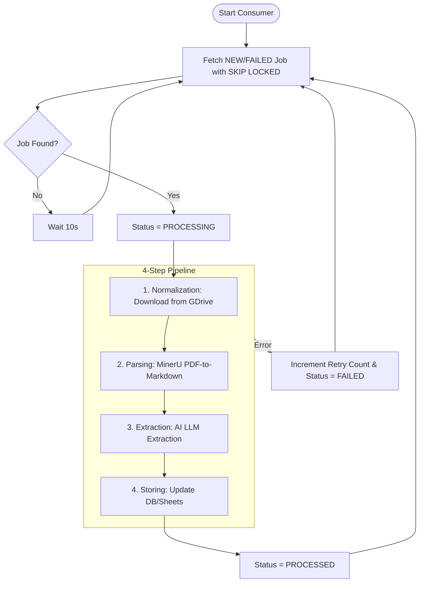

# Consumer Service Flow

This diagram illustrates the internal state machine and processing pipeline of the Consumer service.

```mermaid
graph TD
    Start([Start Consumer]) --> LockJob[Fetch NEW/FAILED Job with SKIP LOCKED]
    LockJob --> Found{Job Found?}
    
    Found -- No --> Wait[Wait 10s]
    Wait --> LockJob
    
    Found -- Yes --> MarkProcessing[Status = PROCESSING]
    
    subgraph Pipeline [4-Step Pipeline]
        Step1[1. Normalization: Download from GDrive]
        Step2[2. Parsing: MinerU PDF-to-Markdown]
        Step3[3. Extraction: AI LLM Extraction]
        Step4[4. Storing: Update DB/Sheets]
        
        Step1 --> Step2 --> Step3 --> Step4
    end
    
    MarkProcessing --> Step1
    
    Step4 --> Success[Status = PROCESSED]
    
    Pipeline -- Error --> Failure[Increment Retry Count & Status = FAILED]
    
    Success --> LockJob
    Failure --> LockJob
```
