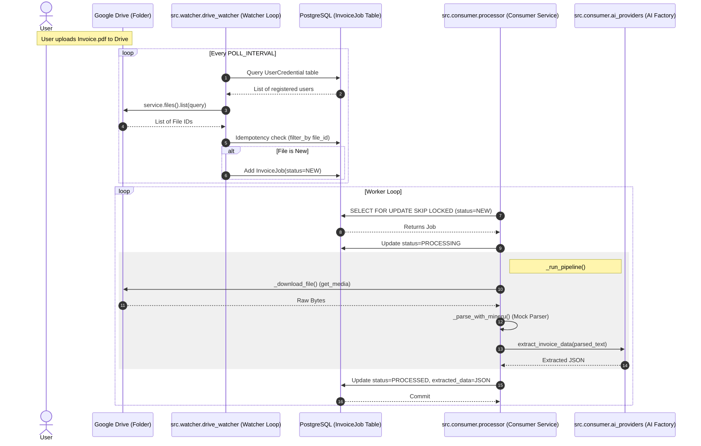

# Consumer Service Flow

## Logic Flow

```mermaid
graph TD
    Start([Start Consumer]) --> LockJob[Fetch NEW/FAILED Job with SKIP LOCKED]
    LockJob --> Found{Job Found?}
    
    Found -- No --> Wait[Wait 10s]
    Wait --> LockJob
    
    Found -- Yes --> MarkProcessing[Status = PROCESSING]
    
    subgraph Pipeline [4-Step Pipeline]
        Step1[1. Normalization: Download from GDrive]
        Step2[2. Parsing: MinerU PDF-to-Markdown]
        Step3[3. Extraction: AI LLM Extraction]
        Step4[4. Storing: Update DB/Sheets]
        
        Step1 --> Step2 --> Step3 --> Step4
    end
    
    MarkProcessing --> Step1
    
    Step4 --> Success[Status = PROCESSED]
    
    Pipeline -- Error --> Failure[Increment Retry Count & Status = FAILED]
    
    Success --> LockJob
    Failure --> LockJob
```

## Detailed Processing Sequence

```mermaid
sequenceDiagram
    autonumber
    actor User
    participant GDrive as Google Drive (Folder)
    participant Watcher as src.watcher.drive_watcher (Watcher Loop)
    participant DB as PostgreSQL (InvoiceJob Table)
    participant Consumer as src.consumer.processor (Consumer Service)
    participant AI as src.consumer.ai_providers (AI Factory)

    Note over User,GDrive: User uploads Invoice.pdf to Drive
    
    loop Every POLL_INTERVAL
        Watcher->>DB: Query UserCredential table
        DB-->>Watcher: List of registered users
        Watcher->>GDrive: service.files().list(query)
        GDrive-->>Watcher: List of File IDs
        Watcher->>DB: Idempotency check (filter_by file_id)
        alt File is New
            Watcher->>DB: Add InvoiceJob(status=NEW)
        end
    end

    loop Worker Loop
        Consumer->>DB: SELECT FOR UPDATE SKIP LOCKED (status=NEW)
        DB-->>Consumer: Returns Job
        Consumer->>DB: Update status=PROCESSING
        
        rect rgb(240, 240, 240)
            Note right of Consumer: _run_pipeline()
            Consumer->>GDrive: _download_file() (get_media)
            GDrive-->>Consumer: Raw Bytes
            Consumer->>Consumer: _parse_with_mineru() (Mock Parser)
            Consumer->>AI: extract_invoice_data(parsed_text)
            AI-->>Consumer: Extracted JSON
        end

        Consumer->>DB: Update status=PROCESSED, extracted_data=JSON
        DB-->>Consumer: Commit
    end
```
