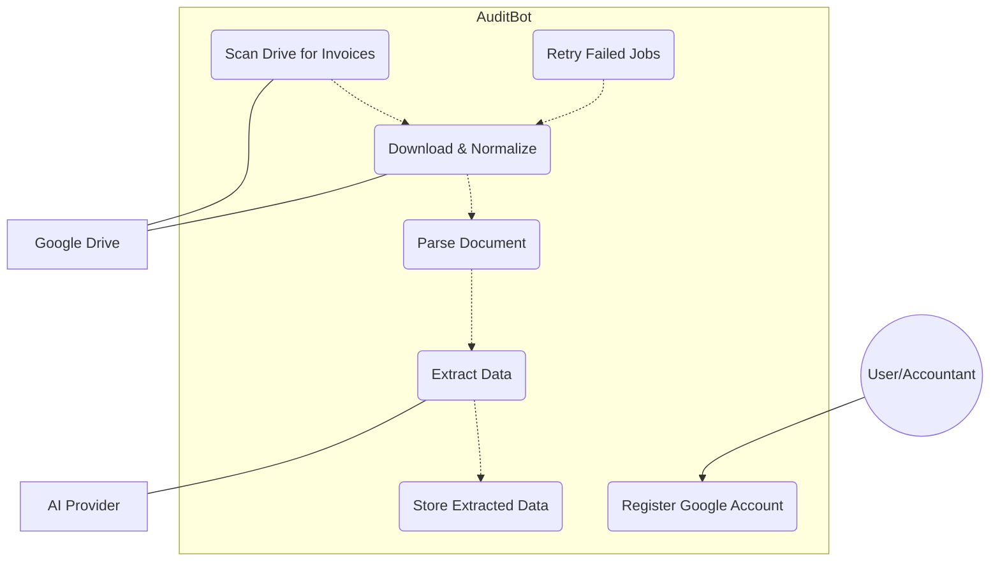
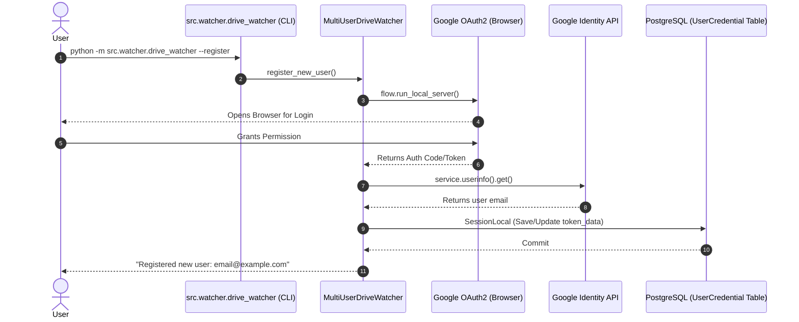

# System Overview (Use Case Diagram)

```mermaid
graph TD
    User((User/Accountant))
    GD[Google Drive]
    AI[AI Provider]
    
    subgraph AuditBot
        UC1(Register Google Account)
        UC2(Scan Drive for Invoices)
        UC3(Download & Normalize)
        UC4(Parse Document)
        UC5(Extract Data)
        UC6(Store Extracted Data)
        UC7(Retry Failed Jobs)
    end

    User --> UC1
    UC2 --- GD
    UC3 --- GD
    UC5 --- AI
    
    UC2 -.-> UC3
    UC3 -.-> UC4
    UC4 -.-> UC5
    UC5 -.-> UC6
    UC7 -.-> UC3
```

# User Registration Sequence

```mermaid
sequenceDiagram
    autonumber
    actor User
    participant CLI as src.watcher.drive_watcher (CLI)
    participant Watcher as MultiUserDriveWatcher
    participant GAuth as Google OAuth2 (Browser)
    participant GAPI as Google Identity API
    participant DB as PostgreSQL (UserCredential Table)

    User->>CLI: python -m src.watcher.drive_watcher --register
    CLI->>Watcher: register_new_user()
    Watcher->>GAuth: flow.run_local_server()
    GAuth-->>User: Opens Browser for Login
    User->>GAuth: Grants Permission
    GAuth-->>Watcher: Returns Auth Code/Token
    Watcher->>GAPI: service.userinfo().get()
    GAPI-->>Watcher: Returns user email
    Watcher->>DB: SessionLocal (Save/Update token_data)
    DB-->>Watcher: Commit
    Watcher-->>User: "Registered new user: email@example.com"
```
