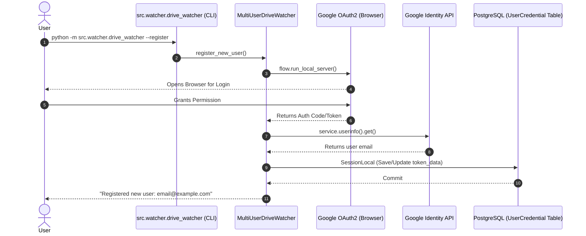

# User Journey Sequence Diagrams

This document highlights the specific sequences triggered by user actions.

## 1. User Registration Flow
Triggered when the user runs the registration command to authorize their Google Drive.

## 2. File Upload & Processing Flow
Triggered when a user adds a new invoice to their monitored Google Drive folder.

```mermaid
sequenceDiagram
    autonumber
    actor User
    participant GDrive as Google Drive (Folder)
    participant Watcher as src.watcher.drive_watcher (Watcher Loop)
    participant DB as PostgreSQL (InvoiceJob Table)
    participant Consumer as src.consumer.processor (Consumer Service)
    participant AI as src.consumer.ai_providers (AI Factory)

    Note over User,GDrive: User uploads Invoice.pdf to Drive
    
    loop Every POLL_INTERVAL
        Watcher->>DB: Query UserCredential table
        DB-->>Watcher: List of registered users
        Watcher->>GDrive: service.files().list(query)
        GDrive-->>Watcher: List of File IDs
        Watcher->>DB: Idempotency check (filter_by file_id)
        alt File is New
            Watcher->>DB: Add InvoiceJob(status=NEW)
        end
    end

    loop Worker Loop
        Consumer->>DB: SELECT FOR UPDATE SKIP LOCKED (status=NEW)
        DB-->>Consumer: Returns Job
        Consumer->>DB: Update status=PROCESSING
        
        rect rgb(37, 13, 78)
            Note right of Consumer: _run_pipeline()
            Consumer->>GDrive: _download_file() (get_media)
            GDrive-->>Consumer: Raw Bytes
            Consumer->>Consumer: _parse_with_mineru() (Mock Parser)
            Consumer->>AI: extract_invoice_data(parsed_text)
            AI-->>Consumer: Extracted JSON
        end

        Consumer->>DB: Update status=PROCESSED, extracted_data=JSON
        DB-->>Consumer: Commit
    end
```

