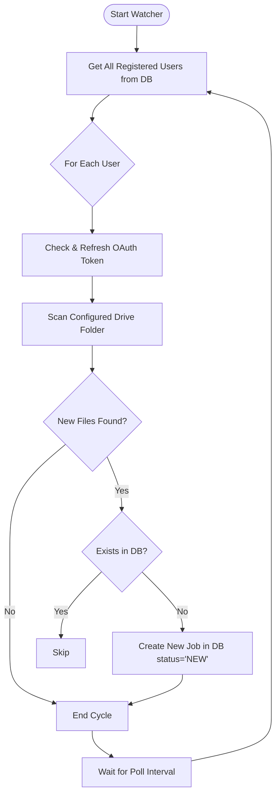

# Watcher Service Flow

```mermaid
graph TD
    Start([Start Watcher]) --> PollUsers[Get All Registered Users from DB]
    PollUsers --> ForEachUser{For Each User}
    ForEachUser --> RefreshToken[Check & Refresh OAuth Token]
    RefreshToken --> ScanDrive[Scan Configured Drive Folder]
    ScanDrive --> NewFiles{New Files Found?}
    
    NewFiles -- Yes --> IdempotencyCheck{Exists in DB?}
    IdempotencyCheck -- No --> CreateJob[Create New Job in DB status='NEW']
    IdempotencyCheck -- Yes --> Skip[Skip]
    
    NewFiles -- No --> EndCycle[End Cycle]
    CreateJob --> EndCycle
    
    EndCycle --> Wait[Wait for Poll Interval]
    Wait --> PollUsers
```
